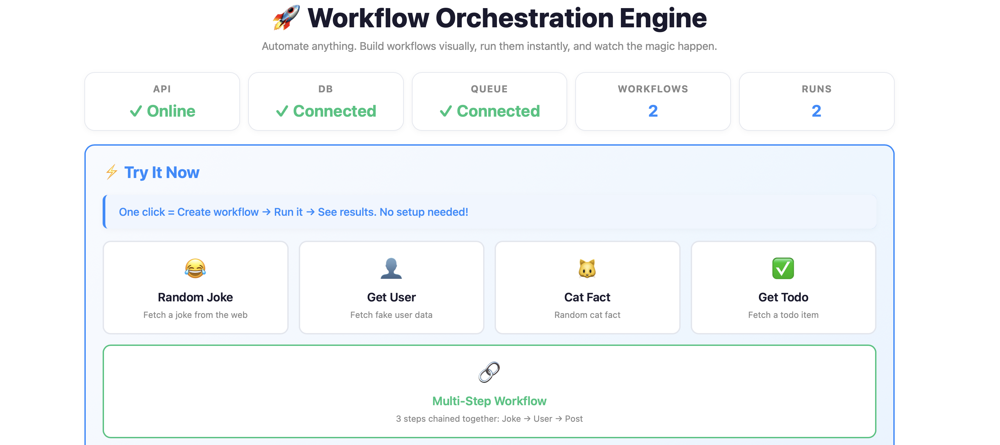

# Airlock: Workflow Orchestration Engine

This is a real backend system for running multi-step workflows with retries, failure recovery, and audit logging. Built with Python, Flask, PostgreSQL, Redis, and Docker. Comes with a visual dashboard and a one-command demo script!

It also deploys to Azure Container Apps with one command (see Azure Deployment below).



---

## Quick Start

1. **Start everything:**
   ```bash
   docker compose up -d
   ```
2. **Open the dashboard:**
   - Double-click `frontend/index.html` or run:
     ```bash
     open frontend/index.html
     ```
3. **Try a workflow:**
   - Click any demo button (Joke, User, Cat, Todo, Multi-Step)
   - See the result instantly!

Or, run all tests in the terminal:
```bash
./demo.sh
```

---

## 🛠️ How It Works (Short Version)

- You define a workflow (like a recipe)
- Add steps (call APIs, transform data, etc)
- Run it (it works in the background, retries if something fails)
- See results and logs in the dashboard

**Architecture:**
```
API (Flask) → Service Layer → Domain → PostgreSQL
                                 ↓
                              Worker (background)
                                 ↓
                               Redis (queue)
```

---

## 🔄 Workflow State Machine

```
        PENDING
          |
        start
          |
       RUNNING
      /       \
 success     failure
   |            |
COMPLETED     FAILED
                  |
      retry (if attempts < max)
                  |
              RETRYING
                  |
               RUNNING
```

- **PENDING** → **RUNNING** → **COMPLETED** (if success)
- If a step fails: **RUNNING** → **FAILED** → **RETRYING** (if retries left) → **RUNNING**

---

## 🔒 Security Model

The engine has an AI Workflow Builder: you describe what you want in plain English and a
local LLM (Ollama) proposes workflow steps. That makes the model an *untrusted input source* —
it decides which URLs the engine will call. The model is asked politely to stick to a list of
public APIs, but a prompt is a suggestion, not a boundary. The real boundaries are enforced in
code, and they hold whether steps come from the AI, the API, or the dashboard.

### 1. Outbound host allowlist

`http_request` steps may only call hostnames on an explicit allowlist
(`ALLOWED_HTTP_HOSTS`, see `.env.example`). Anything else is refused before the request is sent.

On top of that, every address a hostname resolves to must be publicly routable. Private,
loopback, link-local, reserved and multicast ranges are always refused — including
`127.0.0.0/8`, `10.0.0.0/8`, `192.168.0.0/16`, `172.16.0.0/12`, the cloud metadata endpoint at
`169.254.169.254`, and their IPv6 equivalents. This holds even for an allowlisted hostname,
so a permitted name that points somewhere internal still cannot be used to reach it.

Validation **fails closed**: a URL that cannot be parsed or resolved is blocked, not allowed.
It also runs *after* template substitution, so a templated URL like `https://{host}/data`
cannot smuggle a blocked host through via step input.

Enforced in `src/services/url_guard.py`, called from `HttpRequestHandler`. A blocked URL raises
`BlockedUrlError`, which surfaces as a normal step failure in the execution logs.

> The Ollama endpoint itself is operator-configured and is typically on a private address
> (`host.docker.internal`). It is deliberately exempt — the allowlist governs URLs supplied by
> users and by the model, not the model backend you configured yourself.

### 2. Generated workflow validation

Responses from the LLM are strictly validated before becoming a workflow. The response must
be a JSON array (a markdown code fence is tolerated, prose wrapped around JSON is not), and
every step must have:

- a `name` matching a conservative character set,
- a `task_type` that exists in the task handler registry,
- a `config` object, and
- for `http_request` steps, a URL that passes the allowlist check above.

**Any single invalid step rejects the entire response** — there is no partial acceptance.

### 3. Step cap

A generated workflow may contain at most `LLM_MAX_STEPS` steps (default 10), so a confused
model cannot produce a hundred-step workflow.

### 4. Audit log redaction

Execution logs are durable and readable through the API, so anything written to them is
effectively published. Before a log entry is stored, credential-shaped fields
(`api_key`, `token`, `secret`, `password`, `authorization`, …) are masked, and fields that
exist to carry credentials — request `headers` and full step `config` — are dropped wholesale,
since a caller can name an auth header anything at all. See `src/services/redaction.py`.

### 5. Frontend

AI-generated content never passes through HTML parsing. Generated steps are held in a
JavaScript variable and the run handler is attached with `addEventListener`, rather than being
serialized into an inline `onclick` attribute. All model-supplied text is escaped before display.

### 6. Public deployment hardening

When the engine runs on the public internet, a few more layers apply:

- **Write access needs a key.** `POST` requests require an `X-API-Key` header; reading stays public.
  In production the app refuses to start without a key, so a misconfigured deploy fails closed.
- **No redirects, bounded responses.** `http_request` steps never follow redirects (an allowlisted
  host could otherwise bounce the engine to an internal address), bodies are capped at 1 MB,
  and requests time out after 30 seconds.
- **Rate limits per client.** 30 writes and 120 requests per minute per IP, stored in Redis so the
  limit is shared across server processes. Client IPs come from exactly one trusted proxy hop.
- **Browser protections.** A Content-Security-Policy allows only same-origin scripts (no inline
  script at all), plus `X-Frame-Options`, `nosniff`, and CORS disabled in the cloud.
- **Bounded input.** Request bodies are capped at 256 KB and list endpoints at 1000 rows.

---

## ☁️ Azure Deployment

The whole deployment is code: [`infra/main.bicep`](infra/main.bicep) describes it and
[`infra/deploy.sh`](infra/deploy.sh) runs it.

```
GitHub push → GitHub Actions: 247 offline tests → images to GHCR
                                                       ↓
Azure Container Apps (one app, scales to zero)    ←  pulls images
 ├── init: migrate   (applies pending SQL migrations, then exits)
 ├── api             (gunicorn + dashboard)
 ├── worker          (runs workflow steps)
 └── redis           (queue + rate-limit counters, localhost only)
          ↓ TLS
Azure Database for PostgreSQL Flexible Server (B1ms)
```

Design choices, mostly driven by keeping it free on a student subscription:

- **One Container App, three containers.** The worker and Redis run beside the API, and the app
  scales to zero when idle, so it only uses the monthly free compute grant while in use.
  The environment is pinned to `WorkloadProfiles` mode, because the default Express mode
  doesn't allow sidecar or init containers.
- **Images on GitHub Container Registry** instead of Azure Container Registry (no monthly fee).
- **Migrations on every deploy.** An init container runs `python -m src.persistence.migrate`,
  which records applied files in `schema_migrations` and holds an advisory lock, so re-runs are safe.
- **Secrets stay out of git and images.** `deploy.sh` generates the database password, Flask
  secret, and admin key into a git-ignored file; `.dockerignore` keeps them out of images.
- **The AI generator is off in the cloud** (`LLM_ENABLED=false`), since there's no Ollama server.

Known trade-offs: the database firewall allows Azure services (a private network costs extra),
the app connects as the database admin, and queued jobs in Redis don't survive a restart
(PostgreSQL remains the source of truth).

```bash
az login
./infra/deploy.sh                       # prints the app URL
az group delete -n airlock-rg --yes     # tears everything down
```

---

## 📁 Project Structure

```
workflow-orchestration-engine/
├── src/           # All backend code
├── frontend/      # Dashboard (HTML, JS, CSS)
├── tests/         # Unit and integration tests
├── migrations/    # SQL migrations
├── infra/         # Azure deployment (Bicep + deploy script)
├── .github/       # CI: tests, then image builds
├── docs/          # Screenshots
├── Dockerfile*    # Docker setup
├── docker-compose.yml
└── demo.sh        # One-command demo script
```

---

## 💬 Questions?

Open an issue or reach out to me if you have questions or feedback!
